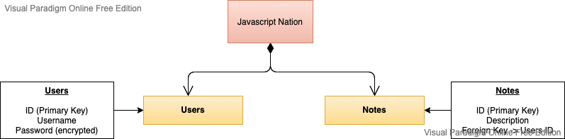

# Javascript-Nation-Blog
## Class-09 Lab

Welcome! To the Code Fellows 401d43 class Javascript Blog! This is an api where users can create blogs/notes and perform full CRUD operations. It is protected by basic and bearer auth.

-------------------------------------------------------

### Contributors: Jaya Dehard, Gina Hobbs, Jessica Parker, Rachael Rice, David Whitmore.

-------------------------------------------------------
    
#### Technologies:
  - Node.js, Express
  - Jest, Supertest
  - base-64, bcrypt, dotenv, JWT
  - Postgres, Sequelize, sqlite3, pg

### Feature Task Assignments
GINA: Database Config, Modelling, & CRUD
JESS/DAVID: User actions on the User model and any additional custom middleware integration  
DAVID/JESS: Routing and Route Testing  
JAYA: Server configuration, setup, and error handling  
RACHAEL: Additional testing and support, floating tasks  

### Links 
- [ci/cd](https://github.com/Javascript-Code-Fellowship/Javascript-Nation-Blog/actions)
- [back-end server url](https://javascript-nation-blog.herokuapp.com/)

### Resources
[Sequelize Docs](https://sequelize.org/master/manual/assocs.html)

#### `.env` requirements
- `PORT` - 8080
- `DATABASE_URL` - DATABASE_URL=postgres://localhost:5432/
- `SECRET` - 

#### How to initialize/run your application (where applicable)

1. `npm i`
2. `npm init:config`
  - make sure your username is in the config file (&password if applicable)
  - check your env to make sure it matches the database name in the config file.
3. `npm db:create`
4. `npm run start`

#### Tests

- How do you run tests?  
  npm run test

- Describe any tests that you did not complete, skipped, etc

#### UML

;
